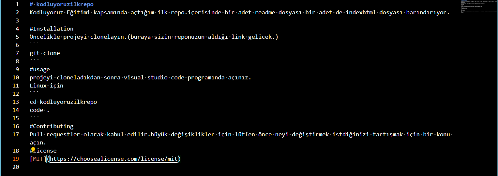

# kodluyoruzilkrepo
Kodluyoruz Eğitimi kapsamında açtığım ilk repo.içerisinde bir adet readme dosyası bir adet de indexhtml dosyası barındırıyor.

#Installation
Öncelikle projeyi clonelayın.(buraya sizin reponuzun aldığı link gelicek.)
```
git clone https://github.com/goktug19/kodluyoruzilkrepo
```
#usage
projeyi cloneladıkdan sonra visual studio code programında açınız.
Linux için
```
cd kodluyoruzilkrepo
code .
```
#Contributing
Pull requestler olarak kabul edilir.büyük değişiklikler için lütfen önce neyi değiştirmek istdiğinizi tartışmak için bir konu açın.
#License
[MIT](https://choosealicense.com/license/mit)



[Patika](https://www.patika.dev/tr)
